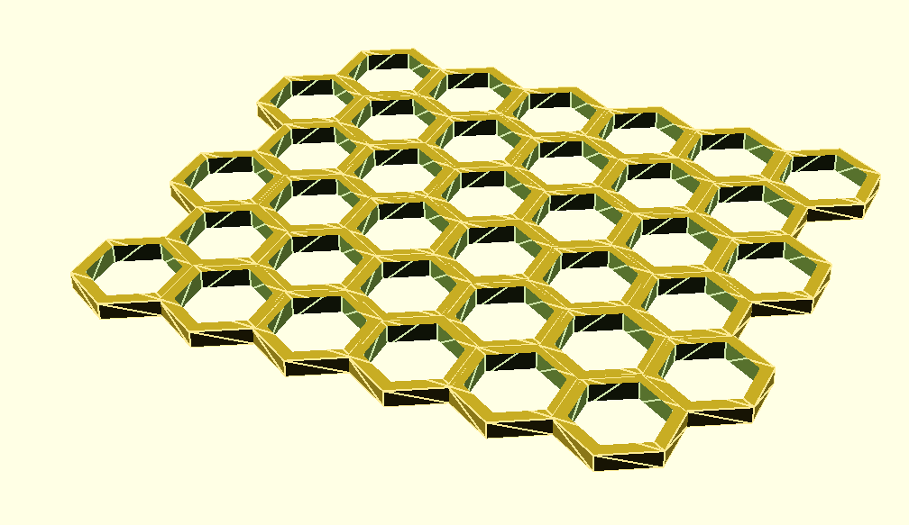
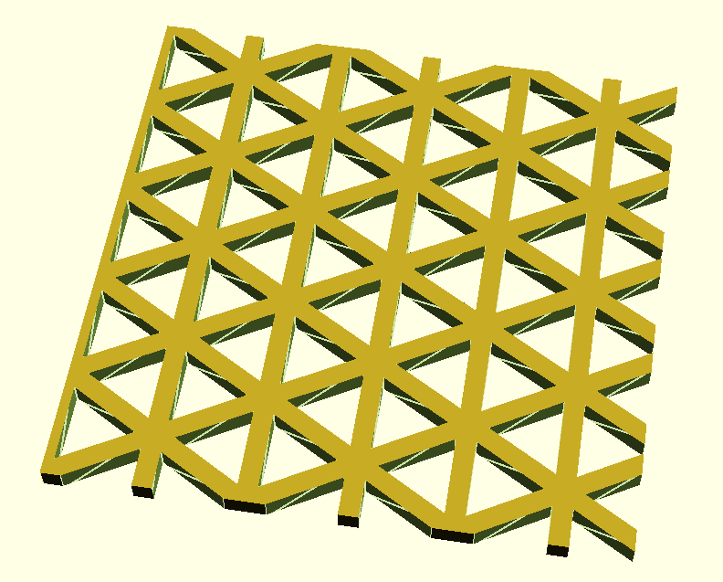
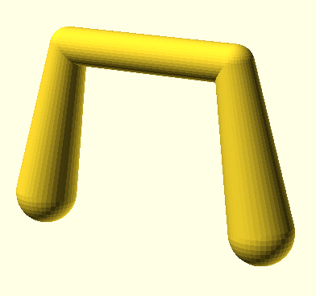

# CootSCAD

My personal Built-In library for OpenScad

Default location would be:

~/dev/CootSCAD

Define OPENSCADPATH to have OpenSCAD look in that directory

export OPENSCADPATH=$HOME/dev/CootSCAD

## hexgrid-coot.scad

### examples/hexgrid-small.scad

### examples/triangle-grid-small.scad

### Hex grid links

<ul>
  <li>
<a href="http://www.redblobgames.com/grids/hexagons/#basics" target="_blank">Red Blob Games - Hexagonal Grids - Basics</a>
  </li>
  <li>
<a href="http://www-cs-students.stanford.edu/~amitp/gameprog.html#hex" target="_blank">Amit’s Game Programming Information - Hexagonal Grids</a>
  </li>
  <li>
<a href="http://www.redblobgames.com/grids/hexagons/" target="_blank">Red Blob Games - Hexagonal Grids</a>
  </li>
  <li>
<a href="http://playtechs.blogspot.com/2007/04/hex-grids.html" target="_blank">PlayTechs: Programming for fun - Hex grids</a>
  </li>
</ul>

## Handle

<!--
html boilerplate

<ul>
  <li></li>
</ul>
<pre>
</pre>
<pre><code>
</code></pre>
-->

